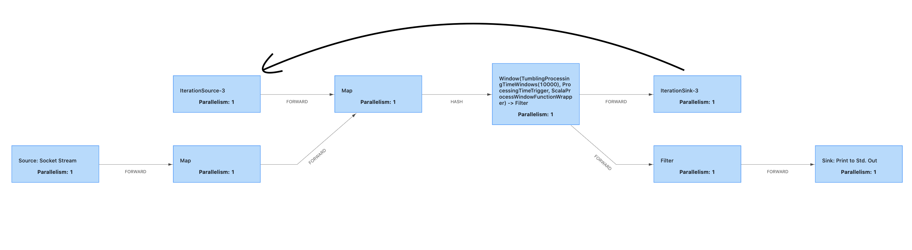
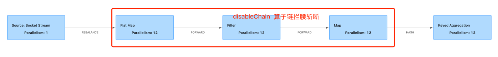

# flink 1.12.0 官网学习总结

## Try flink
### 本地模式安装（略）
### [基于 DataStream API 实现欺诈检测](https://ci.apache.org/projects/flink/flink-docs-release-1.12/zh/try-flink/datastream_api.html)
[详见](src/main/scala/com/bigdata/flink/proj/frauddetect)
```aidl
存在问题：
    下载项目
    mvn archetype:generate \
        -DarchetypeGroupId=org.apache.flink \
        -DarchetypeArtifactId=flink-walkthrough-datastream-scala \
        -DarchetypeVersion=1.12.0 \
        -DgroupId=frauddetection \
        -DartifactId=frauddetection \
        -Dversion=0.1 \
        -Dpackage=spendreport \
        -DinteractiveMode=false
    卡死 
    加 -X 参数，查看具体
    mvn archetype:generate \
        -DarchetypeGroupId=org.apache.flink \
        -DarchetypeArtifactId=flink-walkthrough-datastream-scala \
        -DarchetypeVersion=1.12.0 \
        -DgroupId=frauddetection \
        -DartifactId=frauddetection \
        -Dversion=0.1 \
        -Dpackage=spendreport \
        -DinteractiveMode=false -X
        
    卡在 archetype-catalog.xml 下载
    手动下载 archetype-catalog.xml
    存储到 $MAVEN_HOME/archetype-catalog.xml

功能：自定义source，输出交易流水，keyedProcessFunction 中结合状态进行欺诈失败(小金额体现1$，后面紧随着出现大金额体现1000$，紧随含义1分钟内)。
加工：数据源和输出都已经写好，重点编写报警逻辑 FraudDetector。

知识点：
1.状态：键控状态、算子状态。
2.状态+时间 进行预警键控
```

### [基于 Table API 实现实时报表](https://ci.apache.org/projects/flink/flink-docs-release-1.12/zh/try-flink/table_api.html)
[详见](src/main/scala/com/bigdata/flink/proj/spendreport)
```aidl
下载项目：git clone https://github.com/apache/flink-playgrounds

功能：自定义数据源，输出教育流水到kafka，flink sql映射kafka产生动态表，在其上基于交易时间构建滚动窗口，计算账户最近1小时交易额，结果输出到mysql，grafana 读取 mysql 进行实时监控。
加工：table-walkthrough 设置为maven项目，SpendReport中编写report，实现窗口统计逻辑。数据输出和输出已经写好直接使用。

docker部署：
    cd table-walkthrough 
    docker-compose build 编译镜像(maven、data-generator、table-walkthrough、zk、kafka、mysql、grafana)
    docker-compose up -d 部署容器
    http://localhost:8081 查看flink程序运行 
    docker-compose exec mysql mysql -Dsql-demo -usql-demo -pdemo-sql -D sql-demo 查看mysql数据 select * from spend_report;
    http://localhost:3000/d/FOe0PbmGk/walkthrough?viewPanel=2&orgId=1&refresh=5s 查看grafana的监控大盘
     
存在问题：官网demo中kafka只有一个分区，窗口能够及时关闭。自己基于虚拟机测试时建了3个分区，由于kafka生产数据时(src/main/java/org/apache/flink/playground/datagen/Producer.java)
分区为null，导致部分分区没有数据，及时设置并行度为1，也不能触发窗口关闭。发送kafka消息时将partition设置为key % 分区数 后，保证消息负载均衡，窗口计算就能正常触发执行。

知识点：
1.动态表：基于kafka的source表，基于jdbc的sink表(NO ENFORCED 键的唯一性由使用者自己保证)
2.窗口聚合：TIMESTAMP(3)、TUMBLE、TUMBLE_START
```

### [Flink 操作场景](https://ci.apache.org/projects/flink/flink-docs-release-1.12/zh/try-flink/flink-operations-playground.html#%E6%9F%A5%E8%AF%A2-job-%E6%8C%87%E6%A0%87)
[详细](src/main/java/org/apache/flink/playgrounds/ops/clickcount)
* 部署
```aidl
flink session cluster 、kafka集群
下载
直接下载：git clone --branch release-1.12 https://github.com/apache/flink-playgrounds.git
只取如果已经下载过，执行checkout: git checkout release-1.12

构建镜像
cd ops-playground-image && docker-compose build

启动集群（zk kafka datagen jobmamager taskmanager client）
docker-compose up -d

停止全部容器
docker-compose down -v

停止指定容器 （zookeeper kafka datagen jobmanager taskmanager client）
docker-compose stop kafka
```


* 日志
```aidl
查看 jobmanager 日志信息，刚启动时会存在大量checkpoint-completed 相关信息。
docker-compose logs -f jobmanager

查看taskmanager 日志信息，具体是干活的
docker-compose logs -f taskmanager
```
* kafka
```aidl
查看 input topic
docker-compose exec kafka kafka-console-consumer.sh --bootstrap-server localhost:9092 --topic input

查看 output topic
docker-compose exec kafka kafka-console-consumer.sh --bootstrap-server localhost:9092 --topic output
```
* restful-api
```aidl
在client节点上运行flink命令
docker-compose run --no-deps client flink --help

查看所有job信息：包括正在运行的可已经运行成功的。
curl http://localhost:8081/jobs
docker-compose run --no-deps client flink list

查看指定metrics
curl http://localhost:8081/jobs/<job-id>/metrics?get=lastCheckpointSize

查看全部metrics
curl http://localhost:8081/jobs/<job-id>
```
* 故障容错
[ClickEventGenerator](src/main/java/org/apache/flink/playgrounds/ops/clickcount/ClickEventGenerator.java)
```aidl
原理：ClickEventGenerator中已经设置好每个窗口内生成所有页面生成1000条记录，flink程序按15s窗口统计6个页面点击数。因此只需要查看taskmanager宕机重启后，
窗口统计依旧连续，且仍为1000条。就能证明消息不多不少，精准一次性消费。

查看正在运行flink程序的job-id
docker-compose run --no-deps client flink list

暴力停机
docker-compose kill taskmanager

现象：
    1.input持续有数据进入; 
    2.output无数据输出; 
    3.http://localhost:8081/ 由于jobmanager还在，因此依旧处理running状态，但taskmanager没有的，处于schedule状态。

重新拉起taskmanager
docker-compose up -d taskmanager

现象：
    1.output有数据输出，且输出速率大于之前平稳计算时速率，因为存在数据积压，因此处理速率比之前高。且统计窗口是延续之前的，中断窗口计数依旧为1000；
    2.http://localhost:8081/ taskmanger重新就绪
```
* 保存点(savepoint)
```aidl
原理：容器都还在，但手动停止运行在flink session集群上作业，停机过程生成保存点目录。然后从此保存点目录重启，结果依旧能够延续之前统计窗口，并且统计数字还是1000条。

获取flink作业的job-id
docker-compose run --no-deps client flink list

手动停机（留意停机产生的savepoint目录）
docker-compose run --no-deps client flink stop <job-id>

查看 save point目录 ，注意ba312f是<job-id>的短id,信息都在 _metadata 文件中
ls -lai /tmp/flink-savepoints-directory/savepoint-ba312f-127c465426e8/

现象：output停止输出；

从保存点目录重启（--checkpointing 开启chkp，--event-time使用时间时间，否则按process-time处理）
docker-compose run --no-deps client flink run -s <savepoint> -d /opt/ClickCountJob.jar --bootstrap.servers kafka:9092 --checkpointing --event-time
 
现象：output延续之前窗口统计，且计数还是为1000。
```
* 扩容容错
```aidl
原理：之前都是单taskmanager运行，即，并行度为1。然后正常停止指定任务（注意是听job，不是停taskmanager），升级并行度为3，发现任务无法正常拉起，增加taskmanager数量到2，任务被正常调起。结果依旧能够延续之前统计窗口，且统计数据还是1000；

获取job-id
docker-compose run --no-deps client flink list

停止指定任务（留意生成的保存点）
docker-compose run --no-deps client flink stop <job-id>

现象：output无结果输出；

修改并行度为3（ -p 3），重新提交作业
docker-compose run --no-deps client flink run -p 3 -s <savepoint> -d /opt/ClickCountJob.jar --bootstrap.servers kafka:9092 --checkpointing --event-time

现象：1.output依旧无数据输出;2.http://localhost:8081 由于设置并行度3，taskmanager数量不够（taskmanager.numberOfTaskSlots: 2）导致无法成功调起任务，不停重试；

对taskmanager进行扩容（slost: 2*2=4 ），这一阶段会先停止所有taskmanager，然后启动2个新的。
docker-compose scale taskmanager=2

现象：1.http://localhost:8081/ 随着新taskmanager注册到jobmanager，任务被成功调起; 2.output 延续之前窗口继续统计，数据还是为 1000；

```
* 反压
[BackpressureMap](src/main/java/org/apache/flink/playgrounds/ops/clickcount/functions/BackpressureMap.java)
```aidl
原理：反压是由于数据消费链路上，某个环节消费比较慢，导致消息处理积压。flink反压是基于高效阻塞队列实现的。BackpressureMap中通过设置延迟实现反压效果。
当时间分钟为偶数时，就会进行手动休眠延迟。从而在webUI 演示反压状态。

获取JobId
docker-compose run --no-deps client flink list

手动停止job(留意savepoint)
docker-compose run --no-deps client flink stop <job-id>

重新启动（--backpressure 开启被压开关，会在之前处理逻辑上添加 .map(new BackpressureMap()), 可以理解为算子变更，但依旧可以基于savepoint还原状态）
docker-compose run --no-deps client flink run -s <savepoint> -d /opt/ClickCountJob.jar --bootstrap.servers kafka:9092 --checkpointing --event-time --backpressure

现象：
    1.output 延续之前窗口继续进行统计；
    2.http://localhost:8081 backpressure-map之前的算子出现背压，观察backpresure 周期性进入被压状态，metrics中 outputPoolLength 和 output

背压：
webui找到上游进多，下游出少的算子，选择backpressure，开始以50ms间隔抽样100次，扫描到背压状态次数占比，介于 0~0.1 ok (无背压)，0.1~0.5 low 低背压，0.5~1 高背压。
```


## 实践练习
### [概览](https://ci.apache.org/projects/flink/flink-docs-release-1.12/zh/learn-flink/)
* 流处理
```aidl
批处理：所有数据收集完然后进行处理；（有界流）
流处理：有窗口的场景，以窗口为单位处理数据，无窗口的创建，来一条处理一条。（source > transform > sink）
```

* 并行 dataflow
```aidl
含义：数据处理流程中每个算子都有其对应的一个或多个算子任务，这些任务往往分部在不同线程(同taskmanager不同slots)、或不同容器（不同taskmanager），或不同机器（不同taskmanager）上执行，且都是并行执行的。
各算子子任务领一分区数据单独执行。

算子并行度：算子的子任务数即为该算子的并行度；

整个job并行度：取决于做大并行度算子。

分配并行度：从分配资源角度上给与任务的最大可行并行度；
实际并行度：任务实际使用的并行能力（资源给力不一定都用上了）。

一对一模式：上下游算子子任务处理数据完全是一样的 source[1] -> map[1]，唯一差别在于是在不同线程中执行的；
重分发模式：下游算子子任务接收上游算子多个子任务的数据，进行处理，存在shuffle。
```

* 自定义时间处理
```aidl
使用数据自带时间信息处理数据，此时间称为时间时间EventTime，此外还有类似于spark的处理时间ProcessTime。和到达系统的摄入时间InjectingTime
```
* 有状态流处理
```aidl
含义：当前数据的处理，取决于之前收到的数据。即每次处理当前的，都需要翻旧账。由于是并行处理，状态通常保持在状态后端，直接有算子子任务在本地发起对状态后端的访问。
flink状态访问都是在本地(状态在taskmanager的JVM堆空间或磁盘上，而checkpoint数据存储在jobmanager的内存、文件系统、RocksDB)；状态太大时也可以存储在结构化数据格式高速磁盘上。
```


* 通过状态快照实现的容错
```aidl
流处理：基于状态快照和流回放实现精准一次性消费。
批处理：基于全量数据回放实现精准一次性消费，避免繁重checkpoint操作，正常处理效率高，但故障恢复可能比较慢。
```
### [DataStream API 简介](https://ci.apache.org/projects/flink/flink-docs-release-1.12/zh/learn-flink/datastream_api.html)
* 什么能够被转换为流
```aidl
1.能够被序列话的数据，就能转变为流；

2.flink支持的序列化器
基本数据类型：Integer、Boolean、String、Long、Array;
复合数据类型：Tuple、Pojos、Case Class。
序列化器： Kyro、Avro、其他；
```
* stream执行环境
```aidl
1.DataStream API将本地代码转换为StreamGraph（最贴近用户代码的实现，无并行度概念），然后对齐进行优化生成JobGraph（并行度、算子链），然后附着在env上，
打包发给JobManager。当在client上提交时，上面优化操作在client上完成；
2.JobManager将JobGraph转换为ExecutionGraph，并生成具体执行计划，然后调度任务到taskmanager上执行。
```
[执行环境](images/概念/stream执行环境.png)
* 调试
```aidl
IDE开发：直接打断点，或使用WEBUI启动，查看日志；
真实环境部署：通过查看JobManager、TaskManager日志分析故障原因。
```
* [Taxi实战](src/main/scala/com/bigdata/flink/proj/taxi)
```aidl
小时滚动窗口统计收到小费最高的司机
过滤出启动2h未结束的行程
过滤出出发点和结束点都在NewYork的行程
行程单与费用流水join

知识点：
1.SourceFunction中声明事件和水印；
2.借助方法推算定时器时间，减少状态定义；
3.地理位置换算；
4.connect实现流join；
5.junit测试用例使用
```

### [数据管道 & ETL](https://ci.apache.org/projects/flink/flink-docs-release-1.12/zh/learn-flink/etl.html)
* 无状态转化
```aidl
map：进一个元素出变为另外一个元素，前后元素类型可以不同；
flatMap：进一个集合，出变为一个元素，前后元素类型是一致的
```
* keyedStream
```aidl
作用：对数据进行分组，类似于sql中group by，不一定只有kv才能执行key by，单元素也可以。
shuffle过程存在网络通信、序列化、反序列化。
```
* 有状态转化
```aidl
场景：对当前数据的处理取决于之前收到数据。通常在RichXxxFunction中使用，通过getRuntimeContext 创建，.update 访问，.clear清空。
使用最多的是键控状态，键有无穷个的话，理论上状态也是无穷大。算子状态，常在source和sink中使用。reduce中有隐式状态存在。

flink参与状态管理的好处：
1.本地访问，状态存在在taskManager本地，具有内存级别访问速率；
2.状态是容错的，借助checkpoint和流重放机制可以在分布式无事务环境下实现数据处理一致性；
3.支持纵向扩展，执行内存、文件系统、RocksDB三种插拔式状态后端，且RocksDB可以通过挂载硬盘进行扩容；
4.支持横向扩容，支持修改并行度，动态重分部Key和key的状态到新节点；
5.可查询，支持以flink api方式查询状态。
注：当然状态无非就是数据，也可以收到存储到其他外存，自行管理，并不一定要使用flink的状态管理。
```
* connectedStream
```aidl
connect可以连接两个keyedStream，然后在RichCoFlatMap或KeyedCoProcessFunction中实现流动态拼接，或一个流指导另一个流处理(配置驱动)使用场景
```
### [流式分析](https://ci.apache.org/projects/flink/flink-docs-release-1.12/zh/learn-flink/streaming_analytics.html)
* EventTime & Watermark
```aidl
事件时间：数据中自己带的时间；
摄入时间：flink读取数据时间；
处理时间：数据被算子处理的时间。

Watermark机制: flink程序摄入元素时，在对应的时间上进行一定延迟妥协，一定程度上保证对窗口内乱序数据的兼容性。
注：1.如果确定数据不会发生乱序，则Watermark就可以设置为真实时间，即延迟为0；
2.对于延迟会动态变更场景，也可以设置动态水印，基于最近处理数据的延迟情况，动态决定数据延迟阈值，在计算时效性和准确性上折中。但绝大部分情况下固定延迟可满足需求。
3.watermark(t)，即代表时间t之前的数据都已经到达，之后到达的即便小于t，也不会加入计算，触发允许处理迟到数据allowLateness()，或通过 侧端输出采集迟到数据
交给补偿逻辑处理。
```
* window
```aidl
计数窗口：countWindow 按元素个数统计窗口；
时间窗口：timeWindow 按时间段划分窗口；

分区窗口：keyBy后面是有，用于对分区内元素进行处理，提升数据并行处理能力；
全窗口：无需挂载keyBy后面，因此无法享有分区的并行优势，通常可以爱爱keyBy.window后继续挂载windowAll，实现小聚合后大聚合效果；

滚动窗口：TumbleWindow(size)， 左闭右开，元素无重复；
滑动窗口: SlidingWindow(size,interval)，左闭右开，元素有重复，当interval>size时元素会丢失；
会话窗口: SessionGapWindow(gap)，仅在时间窗口上使用，当相邻元素间隔超过阈值时，就归属为两个窗口，gap可以设置为固定间隔，亦可设置为动态间隔。

注：1.窗口相关API除了window(定义窗口)外还有，trigger() 定义何时出发计算、evictor()定义合适删除元素、allowLateness(time) 迟到容忍阈值、
sideOutputLateDate(outTag) 迟到数据输出；
2.滑动窗口通过复制实现，例如：间隔15min统计最近24h的事件，每个事件将被复制到：(1h/15min)*24 = 96 个窗口中； 
3.时间相关的窗口都是整点对齐窗口，在定义窗口时通过设置offset，也可以不整点对齐；
4.窗口后面可以继续挂窗口计算；
5.空窗口不会触发计算；
6.reduce()、agregate() 基于窗口进行增量计算，来一个元素就会计算一次，等到窗口触发时，可以直接输出数据，因此效率更高。而proecss会先把数据憋起来，
等窗口触发时，一次性处理整个窗口数据，计算效率低下，会导致内存溢出、慎用；
7.ProcessWindowFuntcion中的context，除常规可以获取window、currentProcessTime、currentWatermark外，还可以拿到keyState、globalState这
两个key的当前窗口状态，以及key的所有窗口状态。
```
### 事件驱动
* 处理函数
```aidl
与RichFlatMapFunction类似，在state基础上添加了timer。
注：flink为RocksDB提供了经过优化的ListState和MapState，在采用RocksDBStateBackend情况下，使用ListState、MapState比ValueState效率更高，
RocksSttateBackend可以直接附着在ListState上，MapState中的kv则直接对应一个RocksDB对象。因此访问MapState变得更加高效。
```
* 旁路输出
```aidl
借助旁路输出，可以获取迟到数据，或定向过滤需要数控，实现流的n种自定义切分使用。
```
### 通过状态快照实现容错处理
* State Backend
```aidl
1.keyed state状态是以分片形式存储的，所有key state的工作副本存储在taskmanager本地。此外operatoe state也分布式保存taskmanager本地节点上；
2.flink定期获取所有状态，保存到对应持久化位置，如：文件系统、RicksDB。出现故障时，应用程序回拨到最近的状态，然后流回放，实现对故障的兼容；
3.状态后端分类 (基于磁盘、基于堆内存)
RocksDBStateBackend: 状态存储在本地磁盘，备份到远程文件系统，支持增量/全量快照，适合大KV，大状态场景，比基于堆内存状态慢10倍；
FsStateBackend：状态存储在本地节点堆内存，备份到远程文件系统，只支持全量快照，适合比较大状态计算，但需要也需要较大内存支持，会受限与GC；
MemoryStateBackend: 状态存储在本地堆内存，备份在JobManager的对堆内存，只支持全量快照，运行效率极高，仅在实验、测试环境下使用，故障会导致数据丢失，生产慎用。

注：上面所说的所有状态后端都可以进行异步执行快照。
```
[状态后端](images/概念/状态后端.png)
* 状态快照
```aidl
1.flink source不停在数据流中插入barria，标记当前数据流时间进度，以kafka为例，barria的数值是barria之前当前分区最大消息的offset；
2.barria到达中间算子时，中间算子就记录状态，标识其处理数据进度；
3.中间算子如果有多个输入时，barria提前到达的输入源停止处理数据，等待后面其他输入源barria，等待过程称为barria对齐，当所有barria到达后，此中间算子才开始记录状态。
等待期间，数据憋在缓冲区。barria开始对齐后，重新开始处理数据；
4.barria到达sink算子时，sink依旧会先对齐barria,然后写状态，向jobmanager汇报处理进度，当数据处理到一定进度，jobmanager触发checkpoint，
通知taskmanager执行checkpoint操作，拷贝所有算子最新状态到状态后端。
5.发生故障时，优先从taskmanager本地读取落盘的状态副本进行恢复，本地不存在时，从远处状态后端拉取，将程序整体设置为最近的某个检查点，然后结合流重放，实现故障恢复。
```
[状态快照如何工作](images/概念/状态快照如何工作.png)
* 精准一次性
```aidl
at-most-once: 最多处理一次，flink程序出现故障，数据消费暂停，直接从最新开始读取，数据会丢失；
at-least-once: 最少处理一次，由于缺少barria对齐，数据会重复消费；
exactly-once: 精准一次性消费，出现故障，整体回拨发到最近检查点，然后让source从最近检查点开始重放，数据消费不重不漏；
```
* 端到端一致性
```aidl
由于flink程序只是数据处理的一个中间环节，因此端到端一致性，还需要考虑source，sink数据源特性；
source: 可定点回放，且自身数据最好有去重能力(如：kafka producer 可以实现事务写入、分区存储数据时开启幂等写入配置)，否则flink程序需要做去重处理；
sink: 支持幂等写入（多次写结果一致）或事务写入（故障自动回滚）。

```
## 概念透析
### [概念](https://ci.apache.org/projects/flink/flink-docs-release-1.12/zh/learn-flink/)
```aidl
SQL -- 最顶层抽象，构建在TableAPI之上，使用最简单
Table -- 声明式编程模型，表达能力比core api稍弱，执行前会有优化器，优化执行逻辑；
CoreApi -- 包含DataStream、DataSet 两种API，表达能力弱于Process API，但也能处理绝大部分逻辑。
StatefulStreamProcessing -- 最底层抽象，表达能力最强，使用有一定门槛。
```


### [有状态流处理](https://ci.apache.org/projects/flink/flink-docs-release-1.12/zh/concepts/stateful-stream-processing.html)
* 状态
```aidl
含义：与处理单个元素算子不同，flink中有些算子需要了解之前处理过元素信息，这样的场景就需要状态算子。
flink 基于状态构建的checkpoint、savepoint操作为其故障容错提供实现途径。
```
* 键控状态
```aidl
含义：通俗可以理解为flink内置的kv存储，并且随流一起分布式存储在分区节点，一个key对应一个状态。flink在dataflow的源头周期性在数据元素中间插入barria，
某算子有多个input输入时，算子一旦接受某个input的barria，就不在继续处理此input元素，而是会等待其他input的barria，直到凑齐所有input的barria，
才开始记录状态，然后对前后barria直接数据进行处理，接着继续处理后一个barria的数据。等待barria过程称为对齐。并且等待期间数据是存储在本地缓冲区，
基于对齐操作实现了无事务条件下一致性保证。

常见键控状态有：MapState、ListState、SetState、ReduceState、FoldState、AggregatingState。（一个key一个状态）
常见算子状态：MapState，BroadcastState。（算子一个子任务一个状态）
```
* 状态容错
```aidl
flink 基于流重放(stream reply)和保存点(checkpoint)实现故障容错。
1）checkpoint inverval 在数据处理效率和容错恢复时间直接折中，间隔越短，处理效率越低，间隔越长，故障恢复耗时越长。
2）checkpoint默认是关闭，需要手动开启，故障重启依赖checkpoint。
3）snapshot与checkpoint、savepoint等价，含义一样。

flink的checkpoint机制参照分布式数据流轻量异步快照实现，是Chandy-Lamport algorithm的典型应用。

1）分布式数据处理流中，source处flink会周期性往对应分区插入barria，此barria仅仅标识数据处理进度，对算子不敏感。对于kafka输入流而言，barria就对应是
2）它之前最近一条记录的offset。前后相邻barria(n) 和 barria(n-1) 之间对应的就是第n次checkpoint的增量数据。
3）barria一旦进过某中间算子，算子就会对外部发送自己的barria，标记它处理数据进度。
4）某算子有多个input时，不同input的相同编号barria到达算子时间不一致，先到的input，将不在处理数据(流暂停)，等所有input的barria到齐，写完状态后，继续处理下阶段数据。
barria对齐机制保证无事务状态下，分布式数据处理的一致性。
5) barria经过sink算子时，sink写完状态后，向jobmanager报告状态，jobmanager触发checkpoint操作，所有状态收集到jobmanager内存，写到状态后端。出现故障时，jobmanager
调度taskmanager从状态后端获取最新的状态以其为起点，重新回放流实现数据处理恢复。
```
[barria](images/概念/barria.png)
[barria-align](images/概念/barria-align.png)
[checkpoint](images/概念/checkpoint.png)

* savepoint
```aidl
含义：通俗可以理解为用户手动触发的checkpoint，但不同于checkpoint，无过期概念，使用于人为升级场景(代码变更、配置变更、算子变更、框架升级)，停机保存状态到savepoint目录，
处理变更后，从savepoint重新拉起程序，继续从上次位置接着处理。而checkpoint是有jobmanager周期性触发taskmanager完成的，不需要人工参与，适用于故障自动恢复场景。
```

* exactly once & at least once
```aidl
barria align 保证无事务场景下数据处理一致性，维持精准一次性消费语义，但对齐也带来数据处理延迟问题，对于低延迟响应场景，可以配置跳过对齐，从而提升响应效率。但由此带来重复消费问题。
可以通过下游幂等性纠正。
```

* 批处理模型状态容错
```aidl
flink中批处理被当成特殊流处理，所处理的流式有界的。绝大部分适合流处理场景概念，对批处理也适用。但也有以下几点不同：
1.批处理的容错依赖全量数据回放，而不是checkpoint。一方面因为数据有界，使得全量回放可行，另一方面使得常规计算更加轻量、高效，因为毕竟checkpoint是个比较繁重操作，但随着也
带来故障恢复时间比较长问题。
2.DataSet API 状态使用的不是key/value indexer，而是in-memory/out-of-core data structures；
3.DataSet API中介绍的同步迭代操作仅对有界流有用。
```
### [Flink 架构](https://ci.apache.org/projects/flink/flink-docs-release-1.12/zh/concepts/flink-architecture.html)
* Flink 集群剖析
```aidl
部署模式： local、standalone、yarn-cluster；
组件：
JobManager: 接收作业、执行checkpoint、故障恢复。
    Dispatcher：提供rest接口，提交Flink程序执行、并为每一个提交的作业，启动JobMaster，运行WebUI提供作业执行信息；
    JobMaster：负责管理单个JobGraph执行，Flink集群中可能运行多个作业，每个作业都有自己的JobGraph
    ResourceManager: 负责管理flink集群的资源提供、回收、分配，其所管理的task-slot是flink集群资源调度基本单位；

TaskManager：执行JobManager分配给它的作业流上的任务，缓存并交换数据。拥有一个或多个task-slots。
    Slot：内存独占、CPU共享资源抽象单位；

Client：提交作业，非必须的。
```

* 算子链
```aidl
同一个slot上相邻运行的算子子任务subtask，在满足一定条件下可以合并为算子链，将分配在不同线程中执行的任务，合并到一个线程执行，减少线程切换、数据在线程之间传输时
缓冲、序列化、反序列化开销。

一个TaskManager对应一个JVM 进程，运行在上面的每一个TaskSlot对应一个线程，同一个JVM中的线程之间共用TCP连接(多路复用)和心跳信息。
```


* 资源分配原则
```aidl
1.能chain到一起尽可能chain到一起，减少线程切换，以及数据在线程之间传输开销，如：source map；
2.依据算子是否是计算密集型设置合理并行度，例如：window是计算密集型，需要设置较高并行度，避免处理不过来造成阻塞，而source、map是非计算密集型，在window上游，跟window设置相同并行度就可以。
```

* flink 应用程序执行
```aidl
Flink Session集群：以Standalone部署为例，需要先启动一个flinK集群，然后才能接受客户端提交作业。并且作业执行完毕，Flink集群也不关闭，会常驻，
由于集群实现启动好了，提交作业可以直接计算，因此响应计算快。多个作业直接共用资源。适合计算时间短、资源占用率不高、要求快速响应出结果场景。缺点：
作业直接存在，资源竞争关系，一个作业故障导致JobManager挂掉，所有作业跟着一起挂。（整个集群一个JobManager、多个TaskManager，接收多个作业，
作业之间共用计算资源，一个作业对应生成一个JobMaster，负责调度JobGraph到Slot上运行，一挂全挂）
俗称：Session部署

Flink Job集群：与Yarn部署为例，使用Yarn作为资源调度，每次作业提交都会先在yarn上创建一个flink应用（即JobManager、TaskManager那一套），因此启动时间比较长，
作业直接资源是相互隔离的。可以理解为为每一个作业启动一套（JM,TM），作业执行完毕，集群退出。适合运行：运行时间比较长，占用资源相对较高，且作业直接要有一定隔离的场景。
缺点：启动时间长、结果响应慢、所有作业如果都在一个client上提交，client负责将jar抽象为StreamGraph，然后转换为JobGraph，再提交JobManager将JobGraph转换为
ExecutionGraph，由JobMaster调度到TaskManager的slot上运行。client压力比较集中。（main方法中，execute之前的代码在client上运行，之后代码在JobManager上运行）
俗称：Pre-Job；

Flink Application集群：在Flink Job集群上改进，将整个main方法放在flink集群上执行，而不是在client上执行，避免对client产生冲击。
俗称：Application运行
```
## DataStream API
### [概览](https://ci.apache.org/projects/flink/flink-docs-release-1.12/zh/dev/datastream_api.html)
* 什么是 DataStream
```aidl
DataStream 类似于 java Collection，但比 Collection 更为复杂。
val env = StreamExecutionEnvironment.getExecutionEnvironment()
val ds = env.readTextFile("path")
ds.map()
.writeAsText("path")

env.execute()
```
* Flink Program 开发套路
```aidl
1.创建环境；2.定义 source；3.定制处理逻辑；4.定义 sink；5.触发执行。
```
* 执行环境
```aidl
getExecutionEnvironment() // 自动识别环境，idea中就使用 local,否则就还有本地已经有的 flink 环境。
createLocalEnvironment() // IDE 中创建本地执行环境 
createLocalEnvironmentWithWebUI() // IDE 中创建本地执行环境，并创建 WebUI
createRemoteEnvironment(host: String, port: Int, jarFiles: String*) // 连接远程提交
```
* 同步执行和异步执行
```aidl
// 同步等待出结果
ds.print()
env.execute("Job Name")

// 异步提交，不等出结果就退出了，
ds.print()
val client = env.executeAsync("Job Name")
val jobId = client.getJobId()
val status = client.getJobStatus()
val result = cient.getExecutionResult().get // 阻塞至拿结果
println(result)
```
* 重要 transform 算子
```aidl
readTextFile(path) 按行读取文件
readFile(fileInputFormat,path,watchType,interval,pathFilter) 
    fileInputFormat 自定义文件输入格式
    watchType 是指扫描一次FileProcessingMode.PROCESS_ONCE，还是多次扫描 FileProcessingMode.PROCESS_CONTINUOUSLY
    
iterate() 手动对 DataStream 进行切割，形成 tuple，第一个通过侧输出流输出，第二个通过主流输出
```
* writeXXX 算子
```aidl
writeAsText、writeAsCsv、writeUsingOutputFormat 都是为 debug 使用，不会只想 checkpoint 操作，因此不能维持 exactly-oncey语义，
而且依赖的 OutputFormat多数是按批写出，因此会存在数据丢失问题。写出文件需要实现 StreamingFileSink 接口，才能保证 exactly 语义。
//行
StreamingFileSink.forRowFormat(new Path(path),
 new SimpleStringEncoder<T>())
.withBucketAssigner(new PaulAssigner<>()) //分桶策略
.withRollingPolicy(new PaulRollingPolicy<>()) //滚动策略
.withBucketCheckInterval(CHECK_INTERVAL) //检查周期
.build();
 
//列 parquet
StreamingFileSink.forBulkFormat(new Path(path),
 ParquetAvroWriters.forReflectRecord(clazz))
.withBucketAssigner(new PaulBucketAssigner<>())
.withBucketCheckInterval(CHECK_INTERVAL)
 .build();
```
* 故障容错
```aidl
借助 state 和 checkpoint 实现
```
* 延迟容忍（吞吐量)
```aidl
env.setBufferTimeout(millSecs) 设置全局 buffer 超时时间，为-1时，会等 buffer 装满后再输出，数据延迟比较大。可以设置一个>0值，即等待一定时间后，
即使 buffer 未装满也发送。延迟是降低了，但吞吐量下降了，需要权衡。设置为 0 时可能会出错。
```
* Debugging 调试
```aidl
IDE 中断点调试
单元测试用例模拟数据调试
分布式集群输出日志调试
```
* 数据收集算子
```aidl
val env = StreamExecutionEnvironment.getExecutionEnvironment
val ds = env.generateSequence(0, 5)
val iter = DataStreamUtils.collect(ds.javaStream)
println(iter.mkString(","))
```
### [Excution Mode](https://ci.apache.org/projects/flink/flink-docs-release-1.12/zh/dev/datastream_execution_mode.html)
* 什么时候应该使用 Batch Mode
```aidl
Flink Job 中 source 全部为有界数据时，应该优先使用 Batch Mode。Stream Mode 既能处理有界数据，又能处理无界数据。对于无限流作业，可以在上线前
使用模拟数据跑批测试，上线后再使用流式数据跑流处理。因此官方推荐一命令行形式设置运行模式，而不要用硬编码写死。

硬编码
StreamExecutionEnvironment env = StreamExecutionEnvironment.getExecutionEnvironment();
env.setRuntimeMode(RuntimeExecutionMode.BATCH); // BATCH 跑批、STREAMING 流式处理（默认)、AUTOMATIC 有系统觉得是跑批还是跑流。

命令行设置
bin/flink run -Dexcution.runtime-mode=Batch xx.jar
```
* Streaming 与 Batch Mode 的差异
```aidl
1）计算需要资源 和 故障恢复角度
如下图所示，keyBy 、rebalance 将 dataflow 分割为 3 部分，诸如：fliter、map、flatMap 这写算子会直接将数据发往下游同节点 slot，不存在跨 slot
数据访问，而 rebalance 、keyBy 则存在 shuffle 即数据会跨 slot 进行网络分发。
Streaming Mode 中，整个数据处理 pipeline上所有算子都是同时在工作，一个元素被上游处理完，会迅速发往下游，处理链条中间没有以 task 分层的完整中间层结果，
出现故障时，不能从中间层结果恢复计算，而需要将这个 Job 重置到最近检查点，然后配合流重放，进行恢复。特点：计算所需资源多，故障恢复慢；

Batch Mode中，依据是否发生 shuffle，将数据处理流分为 3 个阶段，所有数据处理完一个阶段会形成一个中间层结果，然后被阶段下线，下阶段算子在中间结果上继续算，
等其处理完毕，才会删除上面提到的中间层结果，以层为单位组织计算，出现故障时，从前面层已经计算好的中间层结果恢复计算，而不需要重新拉起整个 Job。可以理解为是串行
分层处理。特点：计算所需资源少，因为整个 pipeline 上算子是分阶段运行，不会同时运行。故障恢复不依赖 checkpoint，而是直接从中间层结果恢复，恢复效率高。

2）状态后端 和 状态
Streaming Mode 中 flink 使用状态后端保存状态，并执行 checkpoint 操作，对应键控状态而言，所有出现的 key 的状态是同时存在的。
Batch Mode 中忽略配置的状态后端，keyBy 算子会对所有数据以 sorting 方式分组，然后逐个 key 处理数据，一次只有一个 key 的状态存在，key 分组数据处理完毕，
就开始处理下一个 key,并清空当前 key 的状态。

3）水印 和 事件时间
使用事件时间是不可避免存在乱序数据问题。
Streaming Mode 只能最大程度避免乱序数据，但不是绝对避免，watermar(T) 到达后，t < T 的数据将不再被处理。
Batch Mode 由于已经获取全部数据，因此在处理前可以对所有数据进行排序，然后按时间顺序处理，是完美水印处理方式。WatermarkAssigner、WatermarkStrategies被忽略，
所有定时器在最后一次性触发。

4）处理时间
Streaming Mode 由flink 在实时摄取数据，数据产生时间与 flink 处理时间存在相关性，因此使用处理时间语义时，尽管没有事件时间准确，但也能很好反应业务趋势。
Batch Mode 由于数据已经收集好，数据生产时间和处理时间相关性不存在了。因此处理结果不能反应真实业务情况。所有注册定时器再最后都会一次性触发。

5）故障容错
Streaming Mode 出现故障，整个作业回拨到最近 checkpoint，然后进行流回放，保证 exactly-once 语义；
Batch Mode 出现故障，从最近完成计算的中间层结果，开始重新计算，相比于流式处理中作业重置到最近检查点，更轻量，故障恢复效率更高。

6）滚动计算
Stream Mode Rolling 算子，如：sum、reduce，每进入一个新元素，就触发异常计算。(Batch Mode单值累加器问题，1.12.1已经修复)
Batch Mode 不会出现滚动计算效果，一次性给出最终结果。且 Batch 不支持的操作有：Checkpoint、BroadcastState、Iterations

7) Checkpoint
由于 batch 不支持 checkpoint,因此对于 kafka 的 exactly once 和 StreamingFileSink 的 OnCheckpointRollingPolicy(周期性间隔，文件大小 滚动文件) 不再工作。
Batch 中如果需要事务写出需要使用 Unified Sink API ( it uses the Unified Sink API as proposed in FLIP-143)。

```
[流与批网络缓冲差异](images/概念/流与批网络缓冲差异.png)
### [事件时间](https://ci.apache.org/projects/flink/flink-docs-release-1.12/zh/dev/event_timestamps_watermarks.html)
* 为什么需要Watermark 
```aidl
flink 程序通常依赖时序，因此必须有时间语义的声明，使用 processTime 时，数据多次回放结果都不一样。因此需要使用数据自身包含的时间字段。由于乱序数据无法避免，
因此需要使用水印记录当前处理过数据最大时间戳，水印可以相对事件时间有一定延迟，改延迟可以是固定，也可以是变化的。由此度量 flink 程序处理数据进度。

水印生成通常和事件提取是同步进行的。在提取事件上减去一定延迟，就是当前水印。
```
* 水印声明方式
```aidl
方案 1：实现 SourceFunction，定义 Source 时，在 context 上绑定 timestampAssigner 和 WatermarkGenerator，后续直接使用就可以，例如：Flink Kafka Consumer
默认使用 kafka 自带时间戳作为事件时间，当然此数据如果不准确，也可以取消息内事件字段作为事件时间；

public class TaxiFareGenerator implements SourceFunction<TaxiFare> {

	private volatile boolean running = true;

	@Override
	public void run(SourceContext<TaxiFare> ctx) throws Exception {

		long id = 1;

		while (running) {
			TaxiFare fare = new TaxiFare(id);
			id += 1;
			// TODO HourlyTipsSolution 中没有手动指定 时间语义和水印，原因是因为在Source中ctx里面已经注入了这些
			ctx.collectWithTimestamp(fare, fare.getEventTime());
			ctx.emitWatermark(new Watermark(fare.getEventTime()));

			// match our event production rate to that of the TaxiRideGenerator
			Thread.sleep(TaxiRideGenerator.SLEEP_MILLIS_PER_EVENT);
		}
	}

	@Override
	public void cancel() {
		running = false;
	}
}

方案 2：对 DataStream.assignTimestampsAndWatermarks 显式声明时间戳和水印。

val wms = WatermarkStrategy
  .forBoundedOutOfOrderness[(Long, String)](Duration.ofSeconds(20))
  .withIdleness(Duration.ofMinutes(1))
  
ds.assignTimestampAndWatermark(wms)
```
* 水印创建方式
```aidl
1.周期性生成
    env.getConfig.setAutoWatermarkInterval(intervalTmstp)
    
2.间断式生成
    eg: a.只在需要触发窗口时生成；b.当事件带有某个标记时生成。
```
* kafka 连接器上 watermark 策略
```aidl
1.FlinkKafkaConsumer 默认直接使用 kafka 分区内接收消息时间戳作为事件时间处理，当 kafka 是从其他地方导过来数据时，需要事件消息体内事件字段作为事件时间。
2.对于分区数据源，各分区单独设置自己的水印。某算子有多个输入源时，算子可能同时接收到不分区水印，取较小值(watermark 合并取小)。如果某分区始终没有数据，改分区也就无法生产水印，会阻塞所有计算，
可以通过设置分区闲置超时，从时间层面触发计算。ds.assignTimestampAndWatermark(wms).withIdleness(Duration.ofMinutes(1)) // 超过一分钟，排除空分区，直接计算
3.watermark 被算子发往下游算子前提是，watermark 之前所有数据都已经被当前算子处理，且发往下游了，才会转发当前watermark。
```

* 单调递增水印生成器
```aidl
WatermarkStrategy.forMonotonousTimestamps()
eg: FlinkKafkaConsumer 默认使用的就是 kafka 分区消息接收时间作为水印。消息接收时间戳是单调递增的。
```
* 固定延迟
```aidl
WatermarkStrategy
  .forBoundedOutOfOrderness(Duration.ofSeconds(10))
  eg: 如果预先指定消息最大延迟时间，就可以一次为基准设置水印相比于事件事件的滞后量。
```
### [Working Wih State](https://ci.apache.org/projects/flink/flink-docs-release-1.12/zh/dev/stream/state/state.html)
* KeyedState
```aidl
键控状态：
ValueState[T]：存储基本数据类型、自定义类型元素。
ListState[T]：存储List 集合形式存储元素；
ReducingState[T]：需要实现聚合逻辑，输出与输入类型需要一致；
AggregatingState[IN,OUT]：需要实现聚合函数，输出与输入类型可以不一致；
MapState[K,V]：存储 KV 结构数据
注：
1.只能对 KeyedStream 使用，执行 keyBy() 时可以通过tuple下标指定 key，对于 case class 可以声明字段名称"id"方式指定 key;
2.键控状态遵循 依据 key 分组，存储在不同 slot 上，一个 key 对应一个状态，flink 程序修改并行度时,状态随 key 一起发生迁移；
3.状态后端为RocksDB 时，flink 对 MapState 和 ListState 有特殊优化，MapState 的一个 kv 对应一个RocksDB 对象，ListState 直接附着在 RocksDB 上；
```
* 状态有效期
```aidl
1.状态需要设置过期时间，否则不停增长
2.状态过期方式：
明确知道过期时间点时，设置过期时间 TTL
不明确知道过期时间点时，例如：统计指标达到某状态时清除之前状态，重新积累状态变更；

import org.apache.flink.api.common.state.StateTtlConfig
import org.apache.flink.api.common.state.ValueStateDescriptor
import org.apache.flink.api.common.time.Time

val ttlConfig = StateTtlConfig
    .newBuilder(Time.seconds(1))
    .setUpdateType(StateTtlConfig.UpdateType.OnCreateAndWrite)
    .setStateVisibility(StateTtlConfig.StateVisibility.NeverReturnExpired)
    .build
    
val stateDescriptor = new ValueStateDescriptor[String]("text state", classOf[String])
stateDescriptor.enableTimeToLive(ttlConfig)

TTL 更新策略
StateTtlConfig.UpdateType.OnCreateAndWrite - 仅在创建和写入时更新
StateTtlConfig.UpdateType.OnReadAndWrite - 读取时也更新

TTL 过期可见策略
StateTtlConfig.StateVisibility.NeverReturnExpired - 不返回过期数据
StateTtlConfig.StateVisibility.ReturnExpiredIfNotCleanedUp - 会返回过期但未清理的数据

注：
1.暂时只支持基于 process time 的 TTL，且从 checkpoint 或 savepoint恢复计算时，前后 ttl 设置必须一致，否则报错StateMigrationException。
2.TTL 配置不会保存到 checkpoint、savepoint 中，只对当前 Job 生效；
3.开启 TTL 的map-state，只在用户值支持 null 情况下，才会报错 null，否则需要用NullableSerializer包裹值，才能存储。
4.TTL 默认使用后台线程执行清理，通过 .disableCleanupInBackground.build() 关闭后台清理；
5.可以在执行全量快照时执行状态清理 cleanupFullSnapshot.build()
6.可以设置增量清理 cleanupIncrementally(10, true).build() ；
7.可以在 RocksDB 执行压缩时清理过期状态 .cleanupInRocksdbCompactFilter(1000).build()
```
* DataStream 状态相关 scala api
```aidl
val stream: DataStream[(String, Int)] = ...

val counts: DataStream[(String, Int)] = stream
  .keyBy(_._1)
  .mapWithState((in: (String, Int), count: Option[Int]) =>
    count match {
      case Some(c) => ( (in._1, c), Some(c + in._2) )
      case None => ( (in._1, 0), Some(in._2) )
    })
```
* Operator State
```aidl
1.非 kv 类型 state，常绑定到并行算子上。Kafka Connector 就是一个典型Operator State，算子的每一个并行实例都维护了一个 Map结构的 State，key 为分区
value 为 offset。
2.算子并行度改变时，OperatorState 也在算子实例之间进行重分布；
3.常规 flink 程序中，不会出现 OperatorState，只在 sink、source 环节可能出现，且无需 keyBy 分区。

典型算子状态有：ListState、BroadcasState
```
* Broadcast State
```aidl
广播状态时算子状态的一种，当上游数据需要发往下游所有数据流时，可以以广播形式告知，具体是先创建广播状态，然后将已知流广播，然后在下游中获取广播状态即可拿到上游全部数据。

特点：
1.是 Map结构；
2.需要先创建广播状态描述符，将制定流广播，然后使用未广播流连接广播流，在 CoProcessFunction 中，基于 ctx 获取广播状态，实现下游获取上游数据。
3.通常与特点算子一起使用，如:connect，算子中可以包含多个名称不同广播状态。
```
* CheckpointedFunction 中使用 Operator State
[CheckpointedFunctionInSinkApp](src/main/scala/com/bigdata/flink/proj/datastream/CheckpointedFunctionInSinkApp.scala)
[CheckpointedFunctionInSourceApp](src/main/scala/com/bigdata/flink/proj/datastream/CheckpointedFunctionInSourceApp.scala)
```aidl
需要订阅 checkpoint 成功消息需要实现 CheckpointListener 接口
```
### [Broadcast State 模式](https://ci.apache.org/projects/flink/flink-docs-release-1.12/zh/dev/stream/state/broadcast_state.html)
* 相关 API
```aidl
适用场景：上游数据流、配置流，其中配置流信息需要广播给下游每个 task，用来指导数据处理。

1.创建两个普通流，一个是数据流，一个为之后的广播流；
2.创建广播状态描述器，对广播流进行广播；
3.普通流连接广播流，调用 process 方法，编写 KeyedBroadcastProcessFunction（数据流为 keyed 流) 或 BroadcastProcessFunction（数据流为非 keyed 流)
4.BroadcastProcessFunction 实现 processBroadcastElement() processElement()，前者负责将广播流元素写入广播状态，达到广播效果。后者负责从广播状态取出规则，
用于指导数据处理。前者可以读写广播状态，后者只读广播状态；
5.KeyedBroadcastProcessFunction 中多一个 onTimer() 定时器函数，进行延迟处理逻辑。
6.两个 processElement()函数中ctx作用：
    ctx.getBroadcastState(stateDesc) 获取广播状态
    ctx.timestamp() 查询元素时间戳
    ctc.currentWatermark() 查询当前水印
    ctx.currentProcessingTime() 当前处理时间
    ctx.output(outTag,value) 旁路输出
```
* 注意事项
```aidl
1.没有跨 task 通讯。只有在 processBroadcastElement()函数中可以对广播状态进行写入，且所有 task 中需要保证对广播状态的操作是一致的，如果写入不一致，最终会导致结果不一致。
2.processBroadcastElement 中元素到达顺序在不同 task 中可能不同，因此不能依据元素到达顺序更新广播状态；
3.所有 task 都会对 broadcast state 进行 checkpoint，这样可以避免重启时形成热点文件，但会导致checkpoint 放大。flink 重启时如果增大并行度，task 会读取本身状态，然后新增 task
会轮询读取之前 task 的广播状态。
4.不使用 RocksDB时，broadcast state 存储在内存，需要保证足够大内存。
```
### checkpointing
* 故障恢复前提
```aidl
1.数据源可重放；
2.开启 checkpoint;
3.checkpoint 持久化存储（通常是分布式文件系统)；
```
* checkpoint 相关配置
```aidl
val env = StreamExecutionEnvironment.getExecutionEnvironment()

// 每 1000ms 开始一次 checkpoint
env.enableCheckpointing(1000) // 间隔 1 秒执行一次 checkpoint

// 高级选项：

// 设置模式为精确一次 (这是默认值)
env.getCheckpointConfig.setCheckpointingMode(CheckpointingMode.EXACTLY_ONCE) // 维持 精确一次 语义

// 确认 checkpoints 之间的时间会进行 500 ms
env.getCheckpointConfig.setMinPauseBetweenCheckpoints(500) // 上次 checkpoint 成功开始到下次 checkpoint 启动间隔 500ms

// Checkpoint 必须在一分钟内完成，否则就会被抛弃
env.getCheckpointConfig.setCheckpointTimeout(60000) // checkpoint 耗时超过 1 min，就被丢弃

// 如果 task 的 checkpoint 发生错误，会阻止 task 失败，checkpoint 仅仅会被抛弃
env.getCheckpointConfig.setFailTasksOnCheckpointingErrors(false) // task checkpoint 失败，不报错，但会通知 JobManager

// 同一时间只允许一个 checkpoint 进行
env.getCheckpointConfig.setMaxConcurrentCheckpoints(1) // 同一时间只运行有一个 checkpoint 操作
```
* state 与 checkpoint 关系
```aidl
source 算子周期性往数据流中插入 barria 来标识数据流消费进度，以 kafka 为例，barria 数值对应就是它之前最近一条记录的时间，不同分区，分别产生自己的 barria。
某中间算子收到上游 barria 后，如果有多个 input，就阻塞收到 barria 的 input，等其他 input的 barria，这一等待过程称为 barria 对齐。不同 input 的barria
数值可能不一样，取最小值作为此中间算子的 barria,等待阻塞收集到 buffer 的数据被处理完，将此最小 barria 继续往后面发生，并在本地记录状态。barria 对齐机制确保
无事务条件下数据处理一致性。sink 算子接收到 barria 后，先处理数据，然后记录状态，再通知 jobmanager，jobmanager 调度taskmanager 执行 checnkpoint 操作。
checkpoint 操作具体是通知 taskmanager 拷贝 所有算子 state 到 jobmanager，然后在 jobmanager进行合并。出现故障时 jobmanager 调度 taskmanager 从最近 
checkpoint读取状态，然后回拨 offset，从 checkpoint 之后继续消费，实现无缝容错。

state 存储在TaskManager 本地，checkpoint 存储在 JobManager。 
                      state存储位置                 state副本存储位置
MemoryStateBackend   TaskManager堆内存             JobManager堆内存 
FsStateBackend       TaskManager堆内存             远程文件系统
RocksDBStateBackend  TaskManager本地RocksDB文件     远程文件系统
```
* 迭代作业中的 checkpoint
```aidl
flink 目前没有为迭代作业（iterations)开启一致性保证，强制开启checkpoint 可能会出错。  
env.enableCheckpointing(interval, CheckpointingMode.EXACTLY_ONCE, force = true)
```
### [Queryable State](https://ci.apache.org/projects/flink/flink-docs-release-1.12/zh/dev/stream/state/queryable_state.html)
* 架构
```aidl
QueryableStateClient: 部署在flink集群外，接收用户状态查询请求；
QueryableStateClientProxy: 部署在 TaskManager 上，接收QueryableStateClient转发过来的状态查询请求，查询作业状态，然后响应客户。 默认端口 6069
QueryableStateServer：运行在 TaskManager 上，负责服务本地存储的 state 默认端口 9067。
查询示例：目前只调通 java 版本（src/main/java/com/bigdata/flink/proj/datastream/StateQueryApp.java)，scala 版本尚在调试中
```
* 激活状态查询
```aidl
1.拷贝 flink-queryable-state-runtime_2.11-1.12.3.jar 到 flink 集群 lib 目录；
2.flink 集群 conf/flink-env.yaml 设置queryable-state.enable 为 true。 
3.taskmanager日志中出现'Started the Queryable State Proxy Server'，即表明 Queryable State 被激活。
```
* 可查询声明周期
```aidl
目前只支持job 运行状态查询，job 下线后，状态不可查。
```
### 状态后端
```aidl
RocksDBStateBackend
FsStateBackend
MemoryStateBackend

val env = StreamExecutionEnvironment.getExecutionEnvironment()
env.setStateBackend(...)
```
### 状态数据升级
```aidl
场景：业务变更，导致状态中尤其涉及自定义 pojo（数据 schema) 需要变更字段。
1.目前仅支持自定义Pojo和Avro类型schema升级。
2.Pojo schame 升级：可以增加字段，可以删除字段，不能修改已有字段类型，不能修改 Pojo 的全类名和命名空间。
3.Pojo 升级只能在 flink 1.8 及以上版本的 savepoint，1.8 以前的版本不支持升级；
4.Avro 升级只要 Avro 数据解析规则兼容即可；

状态升级步骤：
1.正在运行程序保存 savepoint;
2.修改代码，从 savepoint 重新启动作业；
3.flink 作业自动从 savepoint 恢复，首次读取状态时，会判断 schema 有没有变更，如果有变更就自动进行 schema 合并。
```
### [自定义状态序列化器](https://ci.apache.org/projects/flink/flink-docs-release-1.12/zh/dev/stream/state/custom_serialization.html)
```aidl
声明状态描述符 StateDescriptor 时，需要提供状态类型，此类型需要实现 TypeSerializer 接口。
class CustomTypeSerializer extends TypeSerializer[(String, Integer)] {...}

val descriptor = new ListStateDescriptor[(String, Integer)](
    "state-name",
    new CustomTypeSerializer)
)

checkpointedState = getRuntimeContext.getListState(descriptor)
```
### [自定义函数](https://ci.apache.org/projects/flink/flink-docs-release-1.12/zh/dev/user_defined_functions.html)
* 普通 lambda 函数
```aidl
val data: DataSet[Int] = // [...]
data.reduce { (i1,i2) => i1 + i2 }
data.reduce { _ + _ }
```
* RichXxxFunction 富函数
```aidl
class MyMapFunction extends RichMapFunction[String, Int] {
  def map(in: String):Int = { in.toInt }
};
data.map(new MyMapFunction())
```
* 内置函数(累加器)
[IntCounter、LongCounter、DoubleCounter 内置累加器](src/test/scala/com/bigdata/flink/proj/testing/taxi/scala/RideTest.scala)
```scala
val env = StreamExecutionEnvironment.getExecutionEnvironment
val accName = "count"
env.fromElements((1L, 3L), (1L, 5L), (1L, 7L), (2L, 4L), (2L, 2L))
  .keyBy(0)
  .flatMap(new RichFlatMapFunction[(Long,Long),Long]() {
    private val counter:IntCounter = new IntCounter() // 声明累加器
    private var state:ValueState[Long] = _

    override def open(parameters: Configuration): Unit = {
      getRuntimeContext.addAccumulator(accName,counter) // 注册累加器
      state = getRuntimeContext.getState(new ValueStateDescriptor("sum",classOf[Long],0L))
    }

    override def flatMap(in: (Long, Long), collector: Collector[Long]): Unit = {
      counter.add(1) // 使用累加器
      val acc = state.value()+in._2
      state.update(acc)
      collector.collect(acc)
    }
  }).print()

val result = env.execute("accumulator")
val acc = result.getAccumulatorResult[Int](accName) // 获取累加器结果
println(s"acc: ${acc}")
```
[Histogram](src/test/scala/com/bigdata/flink/proj/testing/taxi/scala/RideTest.scala)
```scala
val env = StreamExecutionEnvironment.getExecutionEnvironment
val hisName = "count-his"
env.fromElements((1L, 3L), (1L, 5L), (1L, 7L), (2L, 4L), (2L, 2L))
  .keyBy(0)
  .flatMap(new RichFlatMapFunction[(Long,Long),Long]() {
    private val his:Histogram = new Histogram() // 声明累加器
    private var state:ValueState[Long] = _

    override def open(parameters: Configuration): Unit = {
      getRuntimeContext.addAccumulator(hisName,his)
      state = getRuntimeContext.getState(new ValueStateDescriptor("sum",classOf[Long],0L))
    }

    override def flatMap(in: (Long, Long), collector: Collector[Long]): Unit = {
      his.add(in._1.toInt) // 使用累加器，对谁进行累加，就传入谁
      val acc = state.value()+in._2
      state.update(acc)
      collector.collect(acc)
    }
  }).print()

val result = env.execute("accumulator")
val acc = result.getAccumulatorResult[util.TreeMap[Int,Int]](hisName) // 获取累加器结果
println(s"acc: ${acc}")
```
[自定义累加器](src/main/scala/com/bigdata/flink/proj/datastream/AccumelatorApp.scala)
### [算子](https://ci.apache.org/projects/flink/flink-docs-release-1.12/zh/dev/stream/operators/)
* 概览
```aidl
map: 输入一个元素，必须输出一个元素，前后元素类型可以不一致。常用于结构转换。

flatMap: 常规用法，对输入元素转化为集合，然后交给内置迭代器，逐个元素输出，常用语集合元素扁平化输出。
    特殊用法 FlatMapFunction 基于输入元素，得到一个集合，可以对集合添加过滤条件，将符合条件的输出。 (输入一个元素返回 0~n 个元素，且返回元素是逐个输出)
    
filter: 输入一个元素，返回 boolean

keyBy: 基于输出元素进行分组，所带参数就是 key，可以是 tuple 的下标，或 case class 的 fieldName。且不光 kv 结构，非 kv 结构也能执行 keyBy;

reduce: 基于输入元素进行迭代，生成新的相同类型元素，每接收一个元素，就迭代计算一次，有窗口就等窗口关闭时输出，没有窗口时，就没计算一次输出一次。有隐藏状态。

aggregations：聚合计算，对应一个函数簇： sum() max() min() maxBy() minBy() 参数可以是 tuple 下标、或 case class 的 fieldName。有 window，
    等到 window 关闭，输出一次，没有 window,没输入一个元素，输出一次，有预计算。
    
window: 窗口： 滚动窗口、滑动窗口、会话窗口。计数窗口、时间窗口。决定将那些数据攒到一起，作为一个批次计算。
    对应衍生操作有 trigger() 何时出发窗口，allowLateness() 窗口触发计算后对迟到数据的容忍程度，sideOutputLateData() 迟到数据收集到哪里去
    窗口触发时，会执行计算然后输出数据，如果未设置 allowLateness()，就直接关闭窗口，关闭后不再接受迟到数据。如果设置延迟容忍，则不会马上关闭窗口，等指定时间后再关闭。
    等待期间，迟到数据依旧会触发计算。未设置sideOutputLateData(),迟到数据最终会丢弃，设置后可以被收集起来继续处理。

windowAll：全窗口，会将上游所有 task 数据收集到一个节点上，然后进行全局处理。
window apply: 对windowStream 使用定义的 WindowFunction。
window reduce: 上面提到过的 windowStream.reduce，在窗口触发时，执行计算输出，之前每接收一个元素都有计算。
window aggretations: 上面提到过的 windowStream.sum() min() max() maxBy() minBy()

union: 类似有 sql 的 union all，ds1.union(ds2,ds3,...) 合并多个结构相同流。

window join: 对窗口内左流和右流数据进行按键拼接，(inner join)

window coGroup: 对窗口内左流和右流数据进行按键拼接，同 join 一样。

connect：连接两个流，流中没进入一个元素，都调用一次对应 processElement1、processElement2 方法。两个流可以共用状态。如果其中一个流是广播流时，只能用非广播流连接广播流。

coMap、coFlatMap: 对 connectStream 按左右流各自特征进行分流处理，coMap、coFlatMap 中是识别流，打标签功能，通过 select 依据标签提取流。

iterate: 获取当前流迭代器，按筛选条件分为符合条件和不符合条件，符合条件的输出，不符合条件的同反馈渠道输出（feedback）。

project: 抽取元祖指定下标元素（只有 java 、python 有）

```
[迭代计算(iterate)](src/main/scala/com/bigdata/flink/proj/datastream/FeedbackStreamDemo.scala)
```aidl
输入流被迭代判断逻辑拆分为两条流，第一条不符合逻辑，重新发往源数据流，继续参与下次迭代，第二条符合逻辑，直接输出。
```
* 没有禁止算子链可以观察到环

* 禁止算子链观察不到环
.png)
  
* 物理分区相关算子
```aidl
partitionCustomer: 指定下标或字段名，按自定义策略分区 (CustomerPartitioner 自定义分区策略)。
keyBy: 按 key 进行 hash 分区（HashPartitioner)，上游 subtask 与 下游 sutask 有固定对应关系；
shuffle: randomly 随机分发 （ShufflePartitioner)，上游 subtask 与 下游 sutask 无固定对应关系；

rebalance: round-robin 上游元素轮询发往下游。数据分布最均匀，对治理倾斜效果显著（RebalancePartitioner)，下游每一个 subtask 都会受到上游每一个 subtask 发过来的数据。

rescale: 上下游算子并行度存在倍数关系（上 2 下 4，或上 4 下 2)，上游算子 subtask 数据平均分发给下游它所对应的 subtask,例如： 
上游并行度为 2（A,B)，下游并行度 4(0、1、2、3)，上游 A -> (0,1)，上游 B-> (2,3)。 RescalePartition，数据是在本地传输，即上游算子 subtask 发往与它同在一个 
taskmanager 上的 下游算子 subtask。无网络传输，效率高。

global: 上游算子 subtask 发往下游第一个 subtask。GlobalPartition。

forward: 上游算子 subtask，发往它本地下游算子 subtask，上下游并行度相同，上下游处于同一个 slot 中，如：print

broadcast: 上游所有 subtask中的数据全量发往下游每一个 subtask，通常用用于广播配置。
```
* 算子链 和 资源组
```aidl
ds.filter().map().flatMap().keyBy().sink()

startNewChain: 从当算子位置开启新算子链，ds.filter().startNewChain().map().flatMap(),正常情况 filter-map-flatmap 可以 chain 到一起，
设置从 filter 处创建新链时，filter 之前是一条链，之后就是另一条链。

disableChain: 禁止当前算子与前后算子 chain 到一起，常用语 debug 调试，故障分析。flink会尽可能将算子 chain 到一起，为提高计算效率。
ds.filter().map().disableChain().flatMap() ，map 处将链条拦腰截断不能成链。

slotSharingGroup("name"): 从当前算子开始分配新 slot，并取名为 name，flink 资源组基本单位为 slot，默认 slot 名称为 default，通过设置 slot 资源组名称
控制算子移到新 slot 上运行，在 slot 上隔离计算。后面算子字段继承前面算子的 slot 资源组。

```
* 算子链形成条件
```aidl
1.没有禁止算子链；
2.上下游处于同一个资源组(slotGroup):
3.上下游并行度一致；
4.上游算子链接策略为 Head（只能与下游算子链接）、Always（即能与上游、又能与下游链接)，下游算子链接策略为 Always；
5.可以 chain 位置，没有手动领取新链 startNewChain；
6.上游算子对下游数据分发策略为 Forward；
7.上下游 shuffle 数据传输不是在批处理模式进行。

上下游算子 subtask 是否在同一个 taskmanager 上运行 -> 本地传输 vs 跨网络数据传输
上下游算子 subtask 是否在同一个 slot 上运行 -> 
上下游算子 subtask 是否在同一个 线程 上运行 -> 线程切换、线程间数据传输缓冲开销、序列化开销 
```
* wordcount算子链

* 算子链拦腰截断

* 另行分配资源组(slot group)

* 手动创建新链

  
### [窗口](https://ci.apache.org/projects/flink/flink-docs-release-1.12/zh/dev/stream/operators/windows.html)
* key vs no key 区别
```aidl
ds.keyBy().window().aggregate()
ds.windowAll().aggregate()
注：keyed 流可以将一个流拆分成多条子流并行处理，非 keyed 流相比于 keyed 流无并行处理概念。
```
* 窗口生命周期
```aidl
从收到第一个元素开始，到窗口关闭为止。
对于时间窗口
滚动窗口、滑动窗口：数据时间超过窗口最大时间[01:00:00,02:00:00)，t > 01:59:59,999，对于事件时间,t是水印时间。
会话窗口：相邻元素时间间隔超过 gap，就拆分为两个窗口。

watermark: 对事件时间使用，处理时间、和摄入时间不使用。有推迟窗口计算，在一定程度上兼容乱序数据效果。
processElement 接收元素
trigger 触发窗口计算，不设置，就按默认触发 (时间够了、数量够了，间隔时间够了)
evictor: 驱逐不再窗口中的数据，删除数据，不会删除窗口状态，不设置，就按默认处理。
allowedLateness: 窗口触发后继续接收迟到数据，并依旧会触发计算，并且有可能导致会话窗口合并，不设置，就默认为 0，即触发计算后立即关闭。
sideOutputLateData: 超过迟到兼容，窗口关闭后，到达的迟到数据，通过侧端输出，不设置就丢弃
getSideOutput: 获取侧输出
```
* 窗口分配器
```aidl
注：flink 1.12.0 开始默认时间语义为事件时间。
滚动窗口：窗口分配器声明后，窗口起止范围就固定了，接收到首个元素时，就生成窗口，不再窗口元素被 evictor 驱逐，trigger 调用触发窗口计算，allowedLateness调用触发窗口关闭。
滚动窗口 size= 1h [01:00:00,01:59:59,9999] 或标记为 [01:00:00,02:00:00), [02:00:00,02:59:59,999]

滑动窗口：size=1h slide=15min [01:00:00,01:59:59,9999] ,[01:15:00,02:14:59,9999]

会话窗口：窗口分配器声明后，窗口起止时间依旧不明确，接收到首个元素时，生成窗口，以后接收每个元素都会窗口，当相邻元素间隔小于 gap 时，就触发窗口合并 merge，间隙超过 gap 时，
就分拆为两个窗口。对迟到数据兼容可能导致之前划分的两个窗口合并为一个窗口。 

offset：时间相关窗口都是整点触发，通过设置 offset 可以错开，不按整点触发。东八区相比于 UTC 早 8h，就可以设置 offset 为 Time.hour(-8)
如：滑动窗口 size=1h [01:00:00,02:00:00) ,设置 offset=15 后，变为 [01:15:00,02:15:00) 

window：对 keyed stream 进行处理，有并行处理优势。
windowAll 专指 no-keyed 窗口，即对元素不按 key 进行并行分流处理，直接全部处理
GlobalWindow 指不限制窗口触发时机，时间窗口和个数窗口结束时机为 Long.Max_Value，需要手动设置 trigger 触发时机。
```


* 窗口函数
```aidl
ReduceFunction：窗口每收集一个元素，触发一次计算，窗口关闭直接输出预先计算好结果，有隐式状态，输入输出元素类型需要保持一致。
AggregateFunction: 窗口每收集一个元素，触发一次计算，窗口关闭直接输出预先计算好结果，有隐式状态，输入输出元素类型可以不一致。
ProcessWindowFunction: 窗口先将元素收集到 iteration 这，窗口关闭时，一次性计算完，显示定义状态，输入输出类型可以不一致。
推荐使用前两个，因为结果预先计算好了，只需要保持一份中间结果。

注：ReduceFunction、AggregateFunction 结果需要引入窗口信息时，可以在后面跟一个ProcessWindowFunction。

class ProcessWindowFunction{
    currentWatermark()
    currentProcessingTime()
    window()
    windowState()
    globalState()  // 可以获取之前状态， evictor 只会清除过期数据，不会清除过期状态
}


自定义 windowFunction 
trait WindowFunction[IN, OUT, KEY, W <: Window] extends Function with Serializable {
  def apply(key: KEY, window: W, input: Iterable[IN], out: Collector[OUT]) // 可以获取窗口信息，但不能获取专题信息
}
```
* 窗口触发器
```aidl
trigger: 定义了窗口何时为窗口计算准备好了。

public abstract class Trigger<T, W extends Window> implements Serializable {
    // count窗口
    public abstract TriggerResult onElement(T var1, long var2, W var4, Trigger.TriggerContext var5) throws Exception;
    // ProcessTime窗口
    public abstract TriggerResult onProcessingTime(long var1, W var3, Trigger.TriggerContext var4) throws Exception;
    // EventTime窗口
    public abstract TriggerResult onEventTime(long var1, W var3, Trigger.TriggerContext var4) throws Exception;
    // Session Gap 窗口
    public void onMerge(W window, Trigger.OnMergeContext ctx) throws Exception {
        throw new RuntimeException("This trigger does not support merging.");
    }
    // 清空窗口数据
    public abstract void clear(W var1, Trigger.TriggerContext var2) throws Exception;
    ....
}

public enum TriggerResult {
    CONTINUE(false, false), // 什么都不做
    FIRE_AND_PURGE(true, true), // 触发窗口计算并清理过期元素
    FIRE(true, false), // 触发窗口计算
    PURGE(false, true); // 清理过期元素
}

PURGE 只会清理不再往下传递的数据，关于窗口的元数据和状态都完好保存。

GlobalWindows 对应 NeverTrigger 类型，需要手动注册自定义 trigger。使用 CountTrigger 时，时间就不能触发，使用 TimeTrigger 时，count 逻辑就不能触发。
如果需要 Count 和 Time 双管齐下，需要定义 trigger。

内置 trigger:
EventTimeTrigger、ProcessTimeTrigger、CountTrigger、PurgingTrigger 透传其他 trigger。

```
* 数据驱逐器
```aidl
窗口可以理解为盛放数据容器，数据源源不断过来，窗口需要维持固定大小，因此必然需要剔除不会使用到的元素，这一动作交给驱逐器负责。
public interface Evictor<T, W extends Window> extends Serializable {
    // 触发窗口计算之前驱逐
    void evictBefore(Iterable<TimestampedValue<T>> var1, int var2, W var3, Evictor.EvictorContext var4);
    // 触发窗口计算之后清除 
    void evictAfter(Iterable<TimestampedValue<T>> var1, int var2, W var3, Evictor.EvictorContext var4);
}

内置驱逐器
CountEvictor：对应 CountWindow
TimeEvictor: 对应 TimeWindow
DeltaEvictor: window buffer 中最后一个元素与其余元素差值超过一定阈值，就剔除，对应 SessionGap 窗口。

默认，在窗口触发前调用evictor()清除不会用到元素。因此如果需要防止预聚合，可以在 evictor()里面实现，所有元素在交给窗口函数前，先要统一给 evictor()处理。
flink 窗口中不会保证元素顺序，尽管窗口中元素或被 evictor() 从头到尾过滤一遍，但被 evictor() 删除掉的元素，不一定是最后一个或第一个。

```
* 迟到数据容忍
```aidl
1）通过设置水印延迟触发窗口计算时机；
2）通过设置迟到容忍，在窗口关闭后，一段时间内，仍旧可处理迟到数据，迟滞窗口关闭；
3）通过侧输出采集迟到比较厉害数据，通过其他补偿逻辑，修改之前计算结果。

要点：
* 1.水印 = 元素时间 - 水印延迟，且水印计算维持只增不减逻辑；
* 2.当前元素计算完水印后，如果水印位置 > 最近窗口最大时间戳(x999为边界),则触发窗口计算。
* 3.窗口触发后，迟到元素不会导致水印增长，因此可以源源不断触发窗口计算
* 4.窗口触发后，如果新元素加入，导致水印增长，在满足 之前触发计算窗口最大时间戳(x999 结尾) + 迟到容忍 < 水印位置调节下，依旧能够接受迟到数据，否则就不能处理，交给侧端输出
```
* 窗口计算结果
```aidl
flink 窗口描述为 [start,end) 左闭右开
窗口最大时间戳 = end - 1 ，即 开放右边界 - 1 毫秒

由于需要兼容迟到数据，导致窗口结果可能会修改，因此计算结果最好带上窗口信息，如：窗口起止时间。
```
* 窗口状态大小
```aidl
1.flink 会为每一个元素在窗口中保存副本，滚动窗口由于没有搭接重复，因此只创建一个副本就可以，滑动窗口由于有搭接重复，每个元素可能存在多个副本，因此对于滑动窗口而言,
窗口不能设置过长，滑动也不能太频繁，否则消耗计算资源非常大（不建议设置 1 天窗口，秒级滑动)。
2.ReduceFunction、AggregateFunction 在窗口计算中，每接收一个元素都会触发一次计算，因此窗口触发时直接出结果，效率高，而 ProcessWindowFunction，会先收集整个窗口元素到迭代器。
然后在窗口触发时，启动计算，收集元素消耗存储，一次性完成窗口计算，效率低下，不建议使用。当前面两两个需要带出窗口信息时，可在后面跟一个 ProcessWindowFunction，此时迭代器里面只有一个元素，
它就是前面聚合计算结果。
3.需要阻止预聚合时，可以在 Evictor 上实现，因为所有元素交给窗口计算前，都要被 Evictor 过滤
```
### [Join](https://ci.apache.org/projects/flink/flink-docs-release-1.12/zh/dev/stream/operators/joining.html)
* WindowJoin 窗口 Join
```aidl
窗口 join 原理：窗口圈住的元素形成笛卡尔积，然后借助 where 条件过滤，得到 key 相同组合，且都是 inner join.
滚动窗口join: 处于同一个窗口,key 相同元素发起连接。无数据重复
滑动窗口join：处于同一个窗口,key 相同元素发起连接。有数据重复
会话窗口join：处于同一个窗口,key 相同元素发起连接。无数据重复
```
滚动窗口 Join

滑动窗口 Join

会话窗口 Join


* IntervalJoin 元素时间范围Join
```aidl
驱动流每一个元素的时间基础上辐射出上下界，圈住被 join 流元素，形成笛卡尔积，然后通过 where 条件过滤得到 key 相同组合。都是 inner join，执行效率比 window join高，因为不需要维持窗口。
```
间隔窗口 Join

### [ProcessFunction](https://ci.apache.org/projects/flink/flink-docs-release-1.12/zh/dev/stream/operators/process_function.html)
* low-level Join 元素 Join 
```aidl
对于 connectStream，借助 CoProcessFunction 可以实现乱序流 join 效果，需要用到状态。

注：与WindowJoin 和 IntervalJoin 不同，CoProcessFunction 实现 Join,没有时间概念，只要元素 key 能匹配上，就能拼接输出。同时可以设置定时器控制 join 延迟报警。
可以操作 state 、timer。 processElement 和 onTimer 的调用是串行的，不用担心并发问题。
```
* 定时器
```aidl
1.借助定时器，可以延迟执行某些检查逻辑；
2.flink1.4.0之前，定时器使用的都是 process time，之后区分 event time 和 process time；
3.定时器会被 checkpoint 保存，因此有容错功能。flink 作业从 savepoint 恢复，本应该在恢复之前触发的定时器，将被立即触发。
4.定时器有 TimerService()管理，onTimer()执行定时器触发事件，deleteXxxTimer 执行删除；
5.同一组 key、timestamp 注册多个定时器时，只有一个被调到执行。
```
### [异步IO](https://ci.apache.org/projects/flink/flink-docs-release-1.12/zh/dev/stream/operators/asyncio.html)
* 需求背景
```aidl
流式处理，通常都是同步调用，即接收一个元素，处理完毕后，才能继续处理下一个元素。数据处理如果闭环在 flink 程序内部，处理效率还好，如果涉及与外部系统交互，存在发请求，等待响应，
接收响应等环节时，效率极其低下，尤其当外部系统提供了异步交互功能时，flink 算子也用不上。因此为适用这种场景引入异步 IO 处理机制。本质上讲数据访问请求存储到异步调用队列，然后由调度器
异步对数据源发起查询，并组织响应，以有序或无序方式返回。实现并行函数实例并发处理数据，分摊阻塞等待时间，提供数据处理吞吐量效果。

使用异步 IO 条件
1.外部数据源支持异步访问，如果不支持，可以使用多线程并行访问，实现批处理效果。
2.flink-1.12.0以上版本。

1.使用 async io 解决数据查询问题，被查询数据源如果支持异步客户端访问：即返回 Future 对象，则直接调用 AsyncFunction
2.被查询数据源如果不支持异步客户端，则需要手动窗口线程池，以多线程方式访问，实现 RichAsyncFunction，在 open 和 close 方法中控制线程池声明周期

```

* 异步 IO 使用
```aidl
1.编写 AsyncFunction 或 RichAsyncFunction 重写 asyncInvoke 方法。如果是异步客户端，直接将异步查询结果(Future)，使用 onSuccess 提取，交给 resultFuture 传出。
如果是非异步查询客户端，可以手动封装 异步查询函数(Future{})，然后按前面异步查询处理。或者创建线程池 ThreadPoolExecutor，手动封装 Runnable 实例，交给 bool.submit()处理。
然后将结果封装到 resultFuture 传出；
2.使用AsyncDataStream.unorderWait(ds,asyncFunc,timeout,capacity) return DataStream，发起异步操作，timeout 控制操作超时，重写 AsyncFunction#timeout() 定制超时逻辑，capacity 
控制并发查询容量，现在并发请求，可以避免上游源源不断下发数据的，导致异步查询持续累计带处理任务，形成背压。
3.unorderWait 无序输出，orderWait 有序输出。
```
* 异步处理顺序
```aidl
unorderWait 无序输出，谁先处理完谁先返回。水印是有序的，水印之间数据处理输出是无序；
orderWait 有序输出，输出顺序与输入顺序一致，效率比无序输出低。水印是有序的，水印之间数据处理输出也是有序；
注：摄入时间、处理时间是特殊事件时间。
```
* 容错
```aidl
异步 IO算子提供了精准一次性语义保证，它将在途请求任务记录在 checkpoint 中，故障重启时会重新发送请求。
```
* Executor
```aidl
异步查询任务离不开 Executor，建议使用DirectExecutor，它能够避免线程切换开销，结果发送和checkpoint 都有专门线程处理。
Executor 有以下两种获取方式：
org.apache.flink.runtime.concurrent.Executors.directExecutor()
com.google.common.util.concurrent.MoreExecutors.directExecutor()
```
* 注意
```aidl
Async IO 不是以多线程方式执行，而是被不同分区数据以此调用，然后借助异步特性，收集结果，达到并行处理数据目的。
异步性能发挥不出来原因：
1.数据源没有提供异步客户端，只有同步客户端 ；
2.异步客户端查询结果 future 被同步阻塞提取结果，没有按异步方式注册回调。

出于一致性原因，异步算子必须放在算子链开头，需要将异步算子，其要与前面算子断开，否则可能出现一致性问题，如果可以接收一致性问题，且必须放在算子链中间，可以修改异步算子的链接策略为
 ChainingStrategy.ALWAYS
```
### [flink 单元测试](https://ci.apache.org/projects/flink/flink-docs-release-1.12/zh/dev/stream/testing.html)
[详见](src/test/scala/com/bigdata/flink/proj/testing/taxi/scala/FlinkJunitTest.scala)
```aidl
maven 依赖
<dependency>
    <groupId>org.scalatest</groupId>
    <artifactId>scalatest_${scala.major}</artifactId>
    <version>3.0.5</version>
</dependency>
        
<dependency>
    <groupId>org.scalamock</groupId>
    <artifactId>scalamock_sjs0.6_2.12</artifactId>
    <version>4.0.0</version>
</dependency>

依赖
import org.scalatest.{BeforeAndAfter, FlatSpec, Matchers}
import org.scalamock.scalatest.MockFactory

```
### flink 任务传参
```scala
// 从文件名解析
val path = getClass.getClassLoader.getResource("args/test.properties").getPath
val tool = ParameterTool.fromPropertiesFile( path)

// 从文件对象解析
val file = new File(path)
val tool = ParameterTool.fromPropertiesFile( file)

// 从文件输入流解析
val input = new FileInputStream(path)
val tool = ParameterTool.fromPropertiesFile( input)

// 从启动参数解析，JVM 参数使用 -Dxx=yy, main 参数使用 --xx yy 
val args = Array[String]("--host","localhost","--port","9001")
val tool = fromArgs(args)

// 先存到 flink job 集群，然在 Rich 函数中通过 context 获取
env.getConfig.setGlobalJobParameters(tool)
new RichFlatMapFunction[String,String]() {
  override def open(parameters: Configuration): Unit = {
    val parameters = getRuntimeContext.getExecutionConfig.getGlobalJobParameters.asInstanceOf[ParameterTool]
    println( parameters.getRequired("host"))
    println( parameters.getInt("port",9001))
  }

  override def flatMap(t: String, collector: Collector[String]): Unit = {
    t.split(",").foreach(collector.collect(_))
  }
}
```
## DataSet API
### [概览](https://ci.apache.org/projects/flink/flink-docs-release-1.12/zh/dev/stream/testing.html)
```aidl
DataSet API主要包含 filter、map 、group、join 等相关算子。专门为处理文件和本地集合等静态数据而生，结果通常使用 sink 输出到分布式文件系统或标准输出。
通常在 Standalone 集群或嵌入其他程序中运行。可以同时在单机和集群上运行。
```

